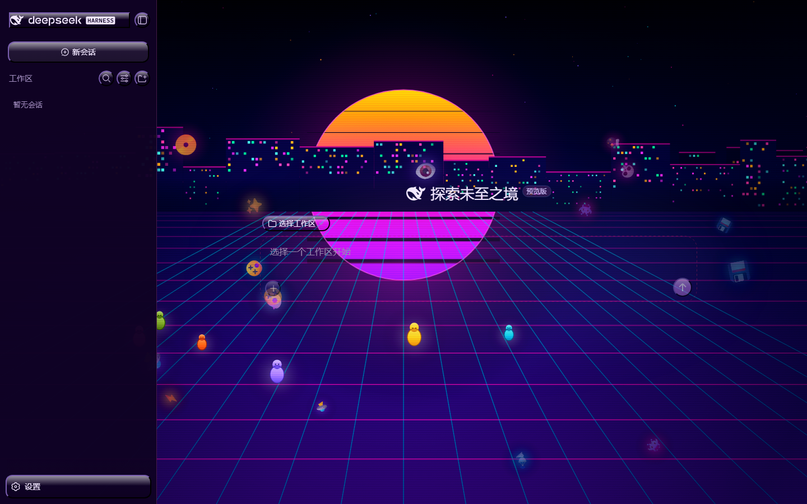

# dsh-skin-xp-vaporwave

**XP 蒸汽波皮肤** 的独立分发仓库（针对 [DeepSeek Harness](https://github.com/deepseek-ai/deepseek-harness) Web GUI）——Windows XP 界面层叠加霓虹蒸汽波城市场景，并带有指针透明的「飞掠城市」画布背景。

皮肤注册进 harness 的 `ui-theme` 皮肤注册表（皮肤 id **`xp-vaporwave`**），因此会与内置的明/暗皮肤、以及其它已注册皮肤一起出现在同一个主题选择器里。

## 效果预览



## 安装

> 需要一个 **web profile**（标准 Web 部署）。harness 已自带本皮肤所需的基础服务，安装本包只是新增皮肤模块。

从 GitHub 安装（默认分支）：

```sh
dsh plugin --profile web add github:sinthome768/dsh-skin-xp-vaporwave
```

若需可复现，固定到完整 40 位 commit SHA（皮肤中心/市场使用的模式）：

```sh
dsh plugin --profile web add github:sinthome768/dsh-skin-xp-vaporwave#<完整commit-sha>
```

安装后需重启 DSH Web 服务，使新 bundle 生效。

## 使用

打开 **设置 → 常规 → 外观/皮肤**，选择 **XP 蒸汽波**；或直接在配置里设置：

```yaml
ui-theme:
  skin: xp-vaporwave
  preference: dark
```

该皮肤是基于属性门控的全局样式表（`body[data-ds-skin="xp-vaporwave"]`），未选中时不生效，切回内置默认主题时会被干净卸载。

## 兼容性

- 目标面：DeepSeek Harness Web 客户端。
- 声明为 `dsh.client.platform: web`（仅浏览器，node 半边为空 `apply`）。
- 客户端 bundle 自包含（除 shell 基础模块外无运行时模块表请求），通过 `./client` 导出。

## 许可

MIT。见 [LICENSE](LICENSE)。源出处：`deepseek-ai/deepseek-harness`（`packages/client/ui-skin-xp-vaporwave`）。
